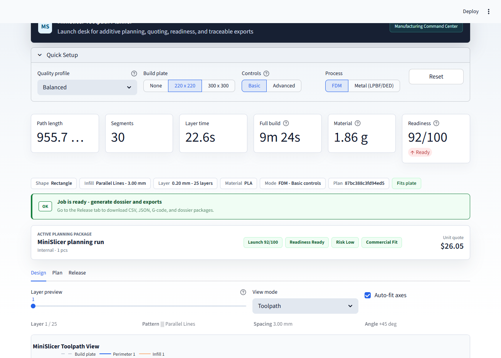
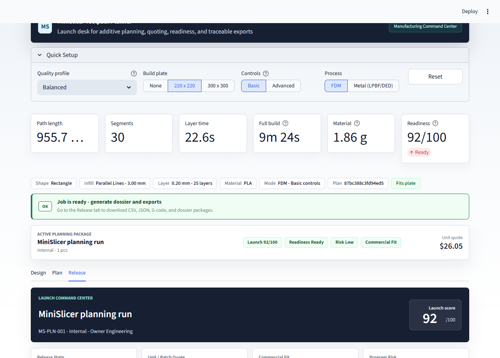
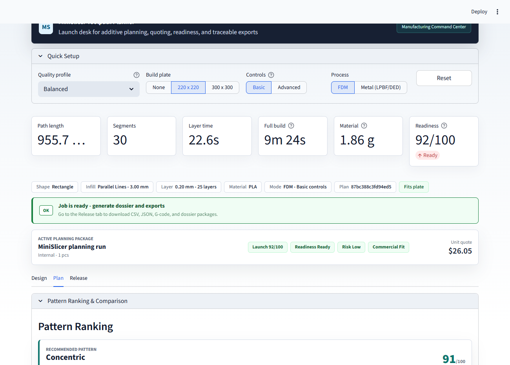
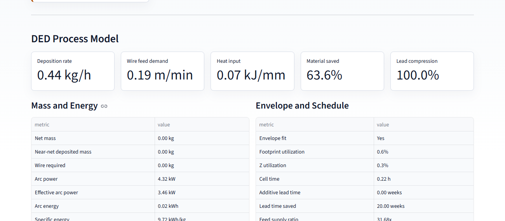
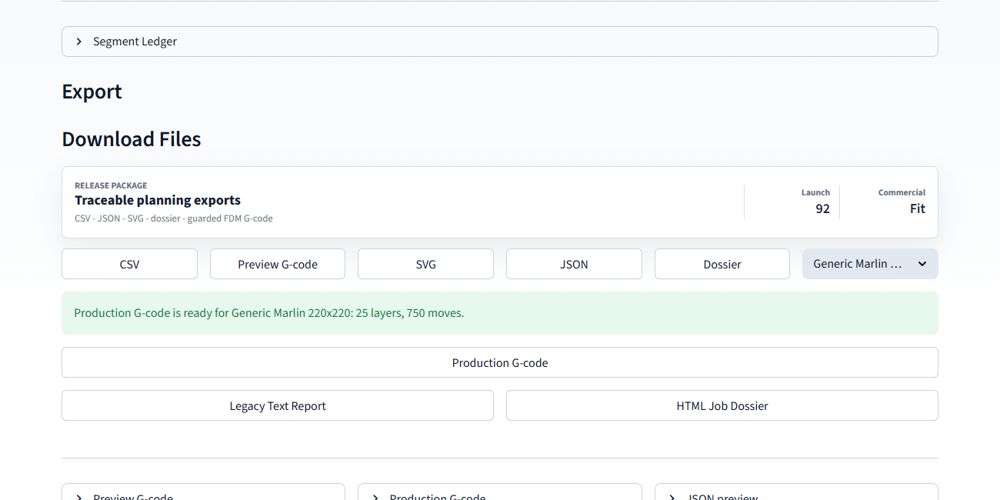

# MiniSlicer Toolpath Planner


MiniSlicer is a Streamlit-based additive manufacturing planning workbench for
exploring 2D slicer logic, comparing infill strategies, reviewing print
readiness, estimating time/material/cost, and exporting traceable planning
packages.

The project is designed as an engineering portfolio and startup-demo prototype:
it connects geometry processing, deterministic toolpath planning,
manufacturability checks, cost-stack modeling, and neutral metal DED/WAAM
feasibility review in one interactive app. It is intentionally honest about its
scope: MiniSlicer is a planning and visualization tool, not a certified
production slicer.

Production FDM G-code export is guarded by readiness checks and machine bounds,
but every job must still be validated on the target machine before release.

## Demo Preview

Representative screenshots captured from the live Streamlit app:

| Design workspace | Release dashboard |
|---|---|
|  |  |

| Pattern comparison | DED process model |
|---|---|
|  |  |

| Export package |
|---|
|  |

## Product Capabilities

| Area | Capability |
|---|---|
| Geometry | Built-in parametric shapes, custom polygons, SVG outline import, and STL cross-section slicing |
| Toolpaths | Inward perimeters, parallel, zigzag, grid, triangular, honeycomb, and concentric infill |
| Planning Engine | Typed toolpath settings, reusable layer planner, full-build segment generation, pattern ranking, and deterministic plan fingerprints |
| Planning | Per-layer and full-build path estimates, acceleration-aware motion time, travel share, material use, wire-feed balance, heat input, interpass dwell, robot-cell feasibility, and deposition rate |
| Executive Review | Launch score, readiness score, program risk, unit/batch quote, productivity, DED process model, manufacturing partner fit, production handoff, launch optimizer, what-if playbook, batch scenarios, release checklist, quality scorecard, and cost-stack view |
| Quality Gates | Plate fit, missing paths, tall layer height, sparse infill, high travel, heavy path count, tall builds, volumetric flow, interpass control, robot reach/payload, and qualification evidence |
| Commercial Controls | Customer/job metadata, application type, conventional route, urgency, qualification level, material strategy, batch quantity, target price, machine rate, labor rate, setup time, postprocess time, scrap, margin, conventional lead time, and machine-capacity guardrails |
| Visualization | Toolpath, extrusion-width, speed map, time map, density map, animation, and 3D layer stack views |
| Export | CSV, JSON, SVG, preview G-code, guarded FDM production G-code, markdown dossier, HTML dossier, and text report |
| Traceability | JSON exports include active parameters and segment data; planning packages receive deterministic fingerprints |

## Quick Start

```powershell
.\scripts\setup.ps1
.\scripts\run.ps1
```

The app opens at:

```text
http://localhost:8501
```

Run the test suite:

```powershell
.\scripts\test.ps1
```

Manual launch:

```powershell
python -m venv .venv
.\.venv\Scripts\Activate.ps1
pip install -r requirements.txt
streamlit run app.py
```

For development (tests + lint), install the dev dependencies instead:

```powershell
pip install -r requirements-dev.txt
```

Docker launch:

```powershell
docker compose up --build
```

Then open:

```text
http://localhost:8501
```

## Example Use Cases

- Demonstrate slicer fundamentals in a manufacturing, robotics, or CAD/CAM
  course.
- Compare infill strategies for path length, travel share, time, and material
  impact.
- Review whether an imported SVG or STL cross-section is reasonable before
  deeper process planning.
- Produce a traceable planning packet for an early-stage customer or internal
  design review.
- Explore how process assumptions affect FDM quote estimates and launch
  readiness.
- Present a neutral DED/WAAM feasibility screen covering envelope fit, wire
  demand, energy, interpass risk, robot reach, payload, and qualification
  burden.

## Workflow

1. Choose a quality profile, build plate, process mode, and control depth in
   Quick Setup.
2. Import SVG/STL geometry or use a built-in parametric shape.
3. Tune perimeters, infill, print settings, placement, optimization, and preview
   appearance.
4. Set job metadata, batch quantity, quote assumptions, target price, and
   machine-time guardrails in Business / Launch.
5. Review the Executive, Quality Scorecard, and Advisor sections in the Release
   tab before exporting.
6. In Metal mode, review the DED process model for envelope fit, wire demand,
   heat input, energy, material savings, and lead-time compression.
7. Review Manufacturing Partner Fit for DfAM suitability, route comparison,
   qualification burden, service deliverables, and value versus conventional
   sourcing.
8. Review Production Handoff for thermal/interpass controls, robot reach and
   payload feasibility, program size, coupons, inspections, and traceability
   records.
9. Use the Launch Optimizer to review top moves, what-if levers, batch
   scenarios, and release checklist status.
10. Export a dossier for sign-off, plus data files for engineering traceability.
11. Use production G-code only when readiness is unblocked, process mode is FDM,
    and the selected machine profile matches the physical printer.

## Portfolio Framing

MiniSlicer is technically valuable because it turns several manufacturing
engineering concerns into a coherent software system:

- Geometry processing: Shapely offsets, clipping, polygon validation, SVG
  parsing, and STL cross-section slicing.
- Toolpath planning: perimeters, multiple infill families, path ordering,
  layer-aware planning, full-build segment generation, and pattern ranking.
- Determinism: stable plan fingerprints connect geometry, settings, process,
  material, and layer count for repeatable review.
- Time and material estimation: acceleration-aware motion timing and bead-volume
  approximations provide more realistic planning signals than length-only
  estimates.
- Readiness checks: the app flags build-plate fit, missing paths, excessive
  layer height, sparse infill, travel-heavy plans, volumetric-flow risk, tall
  builds, and metal-process release concerns.
- Business modeling: transparent quote, cost-stack, productivity, batch, and
  launch-score calculations connect engineering choices to commercial outcomes.
- Metal DED review: neutral WAAM/DED assumptions estimate wire demand, heat
  input, deposited mass, energy intensity, envelope utilization, robot-cell
  feasibility, and qualification evidence.
- Traceable exports: CSV, JSON, SVG, preview G-code, guarded FDM production
  G-code, markdown dossiers, HTML dossiers, and text reports support review
  handoff without claiming machine certification.

## Quick Architecture

```text
Streamlit UI (app.py, ui/)
  -> geometry/import layer (src/geometry.py, src/svg_import.py, src/stl_import.py)
  -> planner/toolpaths (src/planner.py, src/toolpaths.py)
  -> metrics and analysis (src/metrics.py, src/job_analysis.py)
  -> validation gates (src/validation.py)
  -> visualization/export (src/plotting.py, src/animation.py, src/exporters.py)
```

The Streamlit interface collects process, geometry, business, and export
settings. Geometry helpers normalize built-in shapes, SVG outlines, and STL
cross-sections into Shapely polygons. The planner converts validated settings
into per-layer or full-build segments. Metrics and job-analysis modules estimate
time, material, cost, productivity, DED feasibility, and release readiness.
Validation turns those results into user-facing blockers and warnings.
Exporters package the selected layer or full build for engineering review.

See [docs/architecture.md](docs/architecture.md) for a deeper module map.

## Engineering Model

MiniSlicer uses Shapely for geometric offsets, clipping, and polygon validation.
Motion time uses a trapezoidal/triangular acceleration model instead of only
dividing path length by speed. Material estimation uses an elliptical bead
cross-section approximation based on path length, layer height, nozzle diameter,
filament diameter, and material density.

The backend planning engine is isolated from the Streamlit UI. `ToolpathSettings`
defines validated immutable inputs, `plan_layer` returns a complete layer plan,
`build_production_segments` generates full-build exports inside a configured
layer limit, and `rank_infill_patterns` scores candidates for operator review.
Every planning package receives a deterministic fingerprint based on geometry,
toolpath settings, process, material, and layer count.

Metal planning mode adds a neutral wire-arc DED process model. It estimates wire
mass flow from wire diameter and feed rate, deposited kg/h from deposition
efficiency, heat input from arc voltage/current and travel speed, energy per kg,
near-net machining allowance, feedstock required, material saved versus billet
buy-to-fly, build-envelope utilization, and additive lead-time compression.

The manufacturing-partner fit model scores whether a customer job is a good
candidate for a large-format metal AM service workflow. It combines lead-time
compression, material reduction, conventional route, urgency, annual quantity,
qualification burden, tolerances, inspection needs, and redesign effort into a
fit verdict with expected deliverables for customer collaboration.

The production handoff model adds three release-review views: thermal/interpass
planning, robot-cell feasibility, and qualification evidence. Thermal planning
uses arc energy, heat retention, part heat capacity, cooling rate, preheat, and
interpass limit assumptions to estimate dwell. Robot-cell feasibility checks
reach, payload, fixture mass, torch clearance, and program size. Qualification
planning converts the application risk into coupon counts, inspection steps, and
traceability records.

The quote model is transparent by design. Setup labor is amortized across the
batch, while machine time, material, and postprocess labor remain per-part
drivers:

```text
unit quote =
  (((material + machine time + postprocess labor) * batch quantity + setup labor)
   * scrap allowance * margin) / batch quantity
```

Default business assumptions are intentionally conservative and visible in the
analysis code so teams can replace them with their own rates.

Commercial fit compares the calculated unit quote and batch machine hours
against the target price and lead-time guardrails. The launch score combines
technical readiness, program risk, and commercial fit into one executive signal.

## Engineering Validation

The automated test suite covers geometry helpers, toolpath generation, planner
contracts, metrics, validation gates, exporters, job economics, STL/SVG handling,
Plotly figure builders, the Streamlit app shell in default, advanced, and metal
modes, and text-quality checks. Ruff linting runs in CI alongside the tests.

```powershell
.\scripts\test.ps1
```

The script lints with ruff first, then runs pytest.

The tests validate software behavior and deterministic calculations. They do not
certify machine safety, material properties, printer firmware compatibility,
robot collision avoidance, metallurgy, or production readiness. Real deployment
still requires printer-specific slicing review, dry runs, fixturing checks,
material/process qualification, and sign-off by qualified manufacturing
engineers.

See [docs/validation.md](docs/validation.md) for details.

## Example Data

The repository includes small, reviewable example assets under `examples/`:

- `sample-bracket.svg`
- `demo-fdm-job.json`
- `demo-ded-job.json`
- `sample-job-dossier.md`
- `sample-job-dossier.html`

See [examples/README.md](examples/README.md). Large binary fixtures are
intentionally not included.

## Limitations

- This is not a certified production slicer.
- STL handling is focused on horizontal cross-section studies, not robust repair
  of arbitrary non-manifold meshes.
- SVG parsing supports practical closed outlines but is not a full SVG renderer.
- The DED/WAAM model is a neutral feasibility approximation, not a calibrated
  process recipe.
- Preview G-code is educational. Production G-code export is guarded and FDM
  only, and still requires machine validation.
- Collision checking, thermal simulation, support generation, path pressure
  advance, firmware-specific tuning, and closed-loop process control are out of
  scope today.

See [docs/limitations.md](docs/limitations.md) for the fuller list.

## Roadmap

- Improve JSON config round-tripping so exported parameters can repopulate UI
  controls.
- Add richer example STL fixtures with clear licenses and small file sizes.
- Add richer STL diagnostics for scale, units, watertightness, and slice quality.
- Add more machine profiles and explicit profile provenance notes.
- Expand production G-code safeguards with preview simulation and printer-family
  compatibility checks.
- Add optional report templates for recruiting demos, university reviews, and
  customer-facing feasibility studies.
- Add benchmark fixtures for large geometries and dense infill patterns.

## Project Structure

```text
app.py                  Streamlit application entry point
src/geometry.py         Shape creation and polygon validation
src/catalog.py          Shared shape and infill pattern catalogs
src/workflow.py         App workflow helpers for shape construction, placement, and time formatting
src/toolpaths.py        Perimeters, infill generation, ordering, and segments
src/planner.py          Typed planning engine, production segment generation, ranking, and fingerprints
src/metrics.py          Path, time, material, and efficiency metrics
src/job_analysis.py     Quote, productivity, risk, and dossier generation
src/validation.py       Manufacturability readiness checks
src/exporters.py        CSV, JSON, SVG, preview G-code, and production G-code
src/plotting.py         Plotly 2D/3D visualization builders
src/stl_import.py       STL metadata and cross-section slicing
src/svg_import.py       SVG outline parsing
ui/                     Streamlit controls and panels
pages/tutorial.py       Built-in guide and teaching workflow
docs/                   Architecture, validation, limitations, and demo notes
examples/               Small SVG, JSON, and dossier demo assets
tests/                  Pytest coverage plus Streamlit smoke and text-quality checks
```

## Safety Note

MiniSlicer is a planning and visualization tool. It does not replace a qualified
manufacturing engineer, printer-specific slicer validation, material process
qualification, fixture review, collision checking, or machine commissioning.

## License

This project is released under the [MIT License](LICENSE).
